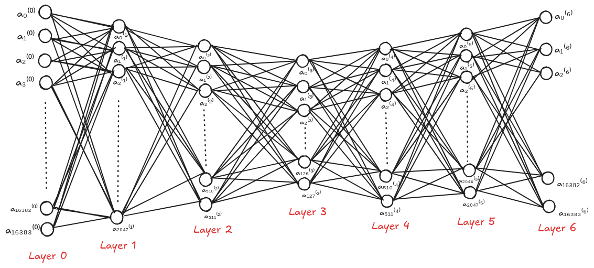

# Face Denoising Autoencoder — from scratch

> No PyTorch. No Keras. No shortcuts. Pure NumPy and Pure Math.

Most people learn deep learning by calling `model.fit()` and watching a progress bar. This project takes the opposite approach — every weight, every gradient, every update is computed entirely by hand. The goal is not just to build something that works, but to deeply understand why it works.

---

## The task

Take a corrupted image of a human face and reconstruct a cleaner version.

```
Noisy input  →  Neural Network  →  Reconstructed face
```

The network receives a damaged photo and learns — through thousands of examples and gradient descent — how to reverse the damage.

---

## Important note

This notebook has no output cells. This version was designed for 128×128 images but could not be trained locally due to memory constraints — W1 alone requires 33 million weights, which exceeds available RAM before training even starts.

This limitation directly motivated a second version and is the exact reason CNNs were invented. See the second version in this repository.

---

## Architecture

The network follows a symmetric hourglass shape — an encoder that compresses and a decoder that reconstructs.

```
16,384 → 2,048 → 512 → [128] → 512 → 2,048 → 16,384
```

The input image is a 128×128 grayscale face, flattened into a vector of 16,384 numbers. The encoder progressively reduces this through two hidden layers (2,048 then 512 neurons) down to a bottleneck of just 128 neurons.

At this point the entire face is represented by 128 numbers — a compression ratio of 128:1. The decoder then mirrors this process in reverse, expanding back through 512 and 2,048 neurons until it reaches 16,384 outputs — the reconstructed face.

| Layer | Size | Role |
|---|---|---|
| Layer 0 | 16,384 | Input — noisy image |
| Layer 1 | 2,048 | Encoder hidden layer |
| Layer 2 | 512 | Encoder hidden layer |
| Layer 3 | 128 | Bottleneck |
| Layer 4 | 512 | Decoder hidden layer |
| Layer 5 | 2,048 | Decoder hidden layer |
| Layer 6 | 16,384 | Output — reconstructed image |

---




---

## How it works — in detail

### 1. The data

The dataset used is **LFW (Labeled Faces in the Wild)** — ~13,000 real face photographs, free and publicly available.

Each image goes through this pipeline:

1. **Convert to grayscale** — removes color, leaving only luminance values
2. **Resize to 128×128** — standardizes every image to the same dimensions
3. **Normalize to [0, 1]** — divide every pixel by 255
4. **Flatten** — the 128×128 matrix becomes a column vector of shape (16384, 1)

To create training pairs, each clean image is artificially corrupted:

```
noisy_image = clean_image + random_noise × 0.1
noisy_image = clip(noisy_image, 0, 1)
```

The network receives the noisy version as input and tries to produce the clean version as output.

---
## Dataset

The LFW (Labeled Faces in the Wild) dataset is not included in this repository due to its size.

You can download it here:
https://www.kaggle.com/datasets/jessicali9530/lfw-dataset
---

### 2. Activation functions

**ReLU** — used in all hidden layers:
```
ReLU(z) = max(0, z)
```

**Sigmoid** — used only at the output layer:
```
σ(z) = 1 / (1 + e^(-z))
```

Sigmoid squeezes any value into [0, 1] — the valid range for pixel values. ReLU is used in hidden layers because its derivative (0 or 1) makes backpropagation calculations clean and efficient.

---

### 3. The forward pass

At every layer:
```
z = W · a + b
a_next = activation(z)
```

Every z and every a is stored — they are all needed during backpropagation.

The weight matrix W at each layer has shape **(neurons_next × neurons_current)**, ensuring the matrix multiplication produces the correct output shape.

---

### 4. The loss function

Mean Squared Error averaged over the batch:

```
C = (1/N) × ||a⁶ - y||²
```

Where a⁶ is the network output and y is the clean target image. One number measuring how wrong the reconstruction is.

---

### 5. Backpropagation

The heart of the project. Backpropagation computes the gradient of the loss with respect to every weight and bias using the **chain rule**.

This project implements **12 Jacobians** — one per weight matrix and bias vector across all 6 layers. Each one is derived and coded manually.

For the output layer:
```
∂C/∂W⁶ = 2(a⁶ - y) × σ'(z⁶) × a⁵ᵀ / N
```

For each hidden layer going backwards, one extra term is added:
```
∂a⁽ᴸ⁾/∂a⁽ᴸ⁻¹⁾ = ReLU'(z⁽ᴸ⁾) × W⁽ᴸ⁾
```

---

### 6. Gradient descent

Every weight and bias is updated after each batch:

```
W = W - learning_rate × ∂C/∂W
b = b - learning_rate × ∂C/∂b
```

Learning rate: **0.01**

---

### 7. Training settings

| Setting | Value |
|---|---|
| Dataset | LFW — 13,233 face images |
| Image size | 128×128 grayscale |
| Input vector size | 16,384 |
| Epochs | 100 |
| Batch size | 32 |
| Learning rate | 0.01 |
| Noise level | 0.1 |

---

## Why this version couldn't train

W1 has shape (2,048 × 16,384) = **33,554,432 weights**.

At 8 bytes per number:
- W1 alone = 268 MB
- All 6 weight matrices = ~1.5 GB
- Add gradients, activations, dataset = crashes 16GB RAM

This is a fundamental limitation of fully connected networks on large images. Every pixel connects to every neuron — the parameter count explodes with image size.

**This is exactly the problem CNNs solve.** A convolutional layer uses small filters (e.g. 3×3) that slide across the image and share weights — dramatically fewer parameters, same learning capability.

---

## What I learned

- How backpropagation works mathematically, not just conceptually
- Why the chain rule is the entire engine of deep learning
- Why CNNs exist and what problem they solve
- How hardware constraints shape architectural decisions
- That understanding every line of code matters more than getting perfect results

---

## Requirements

```
numpy
Pillow
matplotlib
```

No deep learning frameworks required.

---

## Second version

A second version of this project was built at 64×64 resolution and trained on Kaggle. See `mynotebook.ipynb` in this repository.
